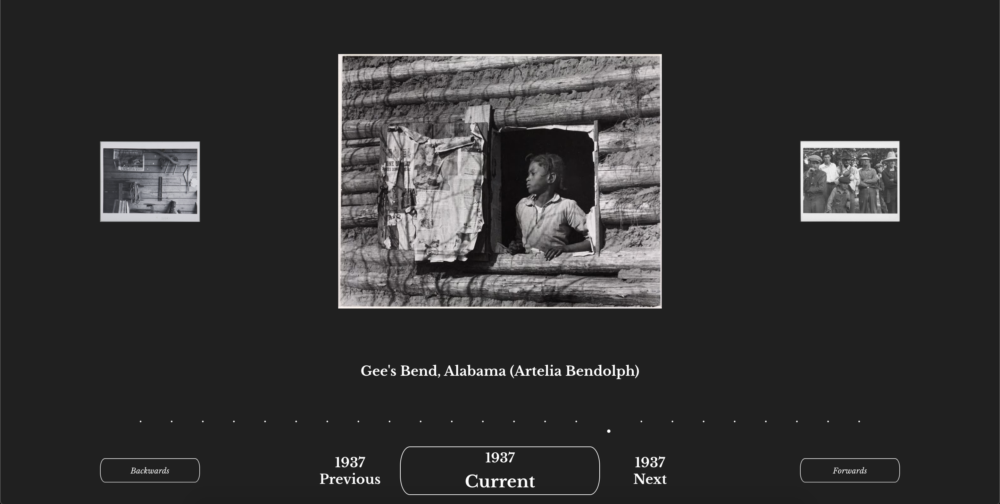
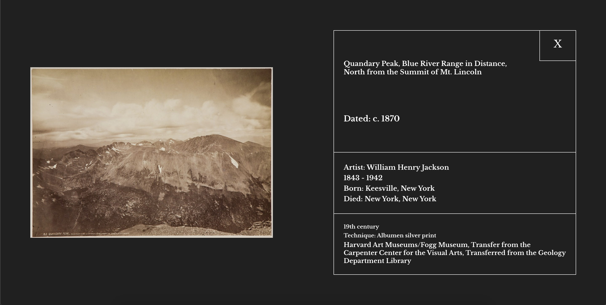

### The American Portrait 
The American Portrait is a timeline visualization tool for historical photos, grouped by state. 
Designed to allow users to engage more closely with the history of their state, it utilizes the Harvard Art Museum API to comb through a vast historical photograph archive. 

#### Live Site
https://the-american-portrait.herokuapp.com/

To note it might take a moment to spin up the heroku instance it it hasn't been recently accessed.

#### Screenshots 

#### Local Setup
To run this project clone down this repo and in the root directory run "npm install".
Once that is complete, run "npm start". 
This runs the app in the development mode.
Open http://localhost:3000 to view the app in your browser.

#### Technologies 
This web app is built using Functional and Class based React components linked utilizing Redux for state management.
Sass is utilized for styling, Jest and Enzyme for testing.
Future iterations will look to refactor to Typescript and React Hooks. 

#### Struggles & Successes
While the Harvard Art Museum API offers wonderful data, and fairly robust request functionality, the museum data itself was very difficult to normalize.

Pieces are often lacking specific fields, and depending on type and classification can have widely disparate structures.

One of the main challenges overall was forming a causal relationship out of so many disparate data points, and then ensuring they had sufficient data to allow for a rich display.

This was achieved through several layers of deconstruction, flattening, bucketing and reconstitution to attempt to create an evenly distributed historical representation. 

#### Issues 
There are several enhancements and refactors still underway for this project. Those can be viewed under Issues.
